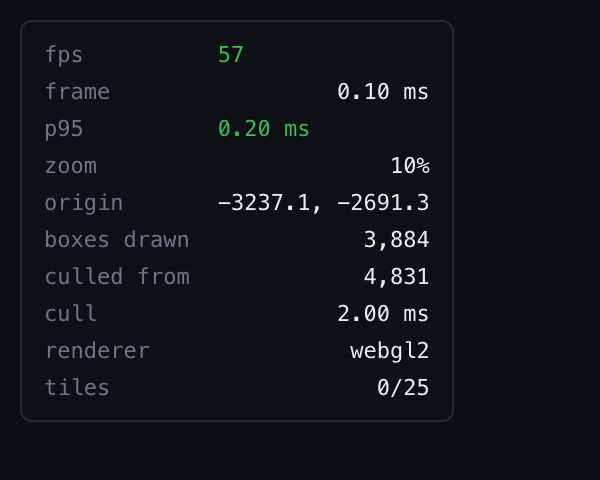

# Performance evidence

Everything here is reproducible from the scripts in [`scripts/`](../../scripts). The
in-app HUD reports the same numbers live, so nothing has to be taken on trust.

## Recorded traces

| File | What it recorded |
| --- | --- |
| `pan-stress-100-pages.json.gz` | Continuous pan over the 100-page benchmark at 10% zoom, 3,884 boxes on screen |
| `pan-sample-zoomed-in.json.gz` | Continuous pan at 500% zoom, 42 page tiles composited |

Both are Chrome DevTools timeline recordings. Open the **Performance** panel and drop the
`.json.gz` file onto it — DevTools loads it directly, no need to unzip.

The screenshots beside them are the workspace's own frame HUD, captured **during** the
pan rather than after it, so the frame rate shown is the one under load.



## Measured results

Captured on a GPU-backed Chromium window, 1440×900 CSS at `devicePixelRatio` 2.

| Metric | Target | Measured |
| --- | --- | --- |
| Frame rate, continuous pan, 100-page document | 60 FPS | 57–60 FPS, 0.1–0.2 ms per frame, p95 0.2–0.4 ms |
| Frame rate with culling switched off (all 11,513 boxes submitted) | 60 FPS | 60 FPS, p95 0.2 ms |
| Main-thread long tasks during live ingestion | < 16 ms | **none**; worst worker event 0.3–0.5 ms |
| Click-to-selection across 11,513 boxes | < 2 ms | 0.1–0.6 ms, including the worker round trip |
| Heap across 18 load / edit / undo / redo cycles | no growth | 4.4 → 5.1 MB, decelerating and flat by the last few cycles |

`frame` is the time this application spends producing a frame — culling, buffer upload,
draw calls, 2D chrome. It excludes the compositor, which is why the frame rate is the
honest headline number and the trace is included alongside it.

## Reproducing

```bash
npm run build
npm run preview                       # in one terminal

# Frame statistics before, during and after a continuous pan
GPU=1 npm run perf:pan -- "Stress test document" 2600
GPU=1 CULLING=off npm run perf:pan -- "Stress test document" 2600

# A DevTools timeline recording plus the HUD mid-pan
GPU=1 npm run perf:trace -- "Stress test document" docs/performance/pan.json 2600

# Heap after repeated load / edit / undo / redo cycles
npm run perf:memory -- 18
```

`GPU=1` opens a real GPU-backed window. **Without it Chromium rasterizes on the CPU**
through SwiftShader, which is not representative: the same pan that holds 60 FPS on a GPU
reports 11 FPS headless, and ingestion picks up long tasks that are canvas painting rather
than anything this application does. Every number above was taken with `GPU=1`.

## Where the frame time goes

At 10% zoom over the whole benchmark document:

- **culling** — one pass over the node spans of the pages the viewport touches: 4,831
  rectangles scanned, 3,884 kept. Roughly 1–2 ms, and it does not run again while panning
  inside the cached envelope, only the transform uniform changes.
- **overlay** — one instanced draw call, independent of how many boxes it contains.
- **page rasters** — `drawImage` per visible tile, snapped to device pixels. Tiles are
  rasterized in a worker, never on the main thread.
- **chrome** — selection outlines, handles, snap guides, reading-order arrows: their own
  canvases, repainted only when they change rather than every frame.
